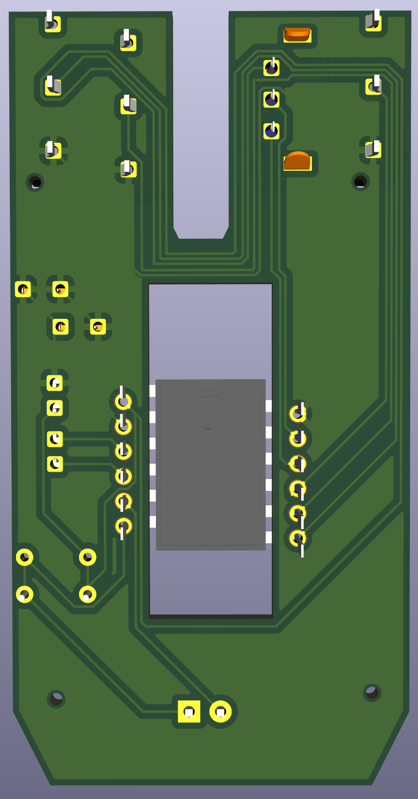
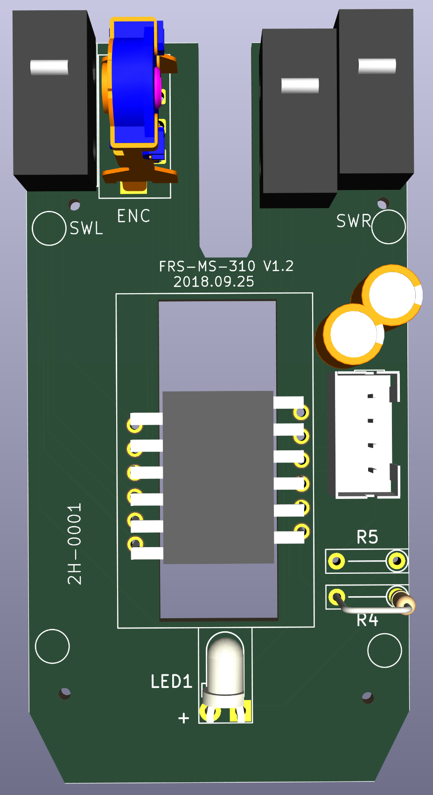
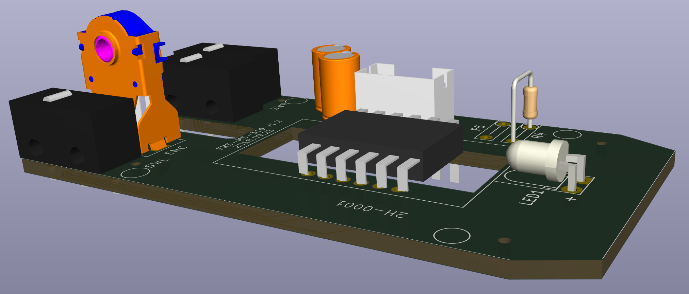
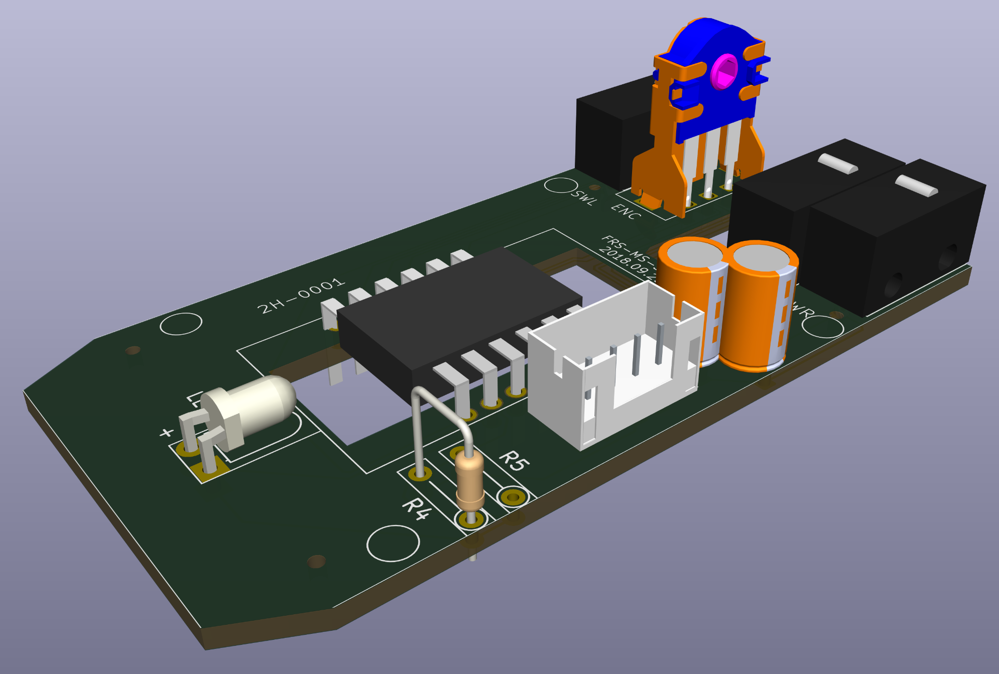
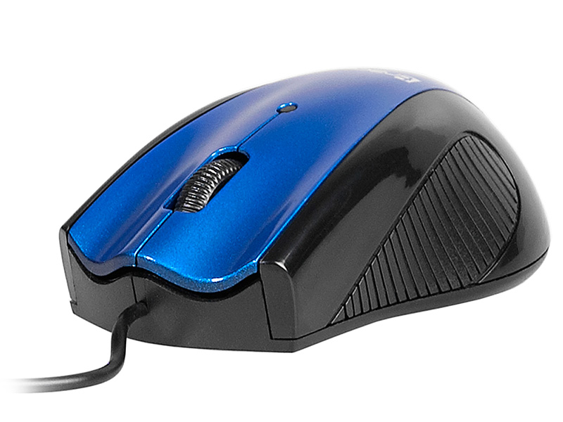
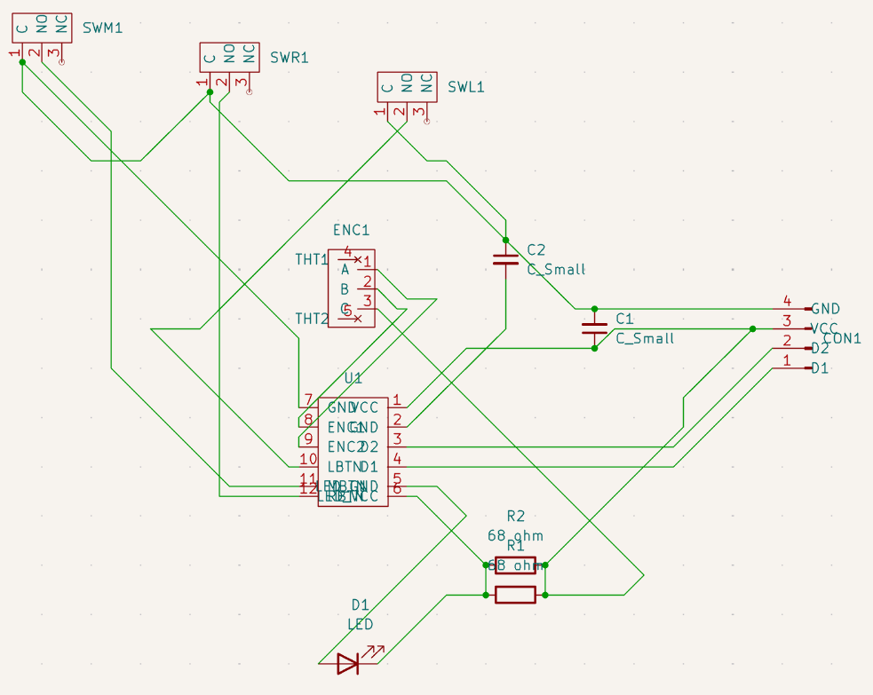

# DazzerBlue TRAMYS44940 Mouse in KiCAD 
[@PrinterFixer](https://www.youtube.com/@PrinterFixer)
[Video title here](VIDEO HERE - IF THERE IS NONE THEN IT IS NOT DONE)

KiCAD project with GERBER and DRILL files of the DazzerBlue TRAMYS44940 mouse PCB from 2018/09/25, remade manually by me, C0m3b4ck. All models of all components are in place, the PCB is of accurate size. The only inacurracies are the connections, which aren't 1:1 to the actual PCB. The microswitch and the rotary encoder are the exact same but from different companies (couldn't find original companies).

**The mouse is end-of-life.**

## Purpose

This repository preserves the complete investigation of the DazzerBlue TRAMYS44940 mouse hardware: project files, documentation and images.
It is intended as a technical reference for anyone analyzing, repairing, or getting inspired by the DazzerBlue TRAMYS44940 design and the V101S-based optical mouse architecture.

## GERBER, DRILL and BOM (click to download)
* [Full labelling and components](https://github.com/C0m3b4ck/DazzerBlue-Mouse/blob/main/DazzerBlue-GERBER-DRILL.7z)
* [Bill of Materials in .CSV](https://github.com/C0m3b4ck/DazzerBlue-Mouse/blob/main/DazzerBlue-BOM.csv)
## Components:
* V101S IC - [unofficial documentation made](https://github.com/C0m3b4ck/DazzerBlue-Mouse/blob/main/DOCS/V101S-unofficial.pdf),
* 2x Illinois KXM Capacitor 100uf - [documentation included](https://github.com/C0m3b4ck/DazzerBlue-Mouse/blob/main/DOCS/Omron-D2F-01-A-datasheet.pdf),
* 68ohm resistor,
* 3x Omron D2F-01 microswitch - [documentation included](https://github.com/C0m3b4ck/DazzerBlue-Mouse/blob/main/DOCS/Omron-D2F-01-A-datasheet.pdf) (same as on PCB but from a different company),
* 2-pin LED,
* 3-pin AlpsAlpine Rotary Encoder,

## Repository layout

- `DOCS/` — component datasheets and board photos.
- 'DazzerBlue-proj/DazzerBlue-proj.kicad_pro' - project file.
- 'DazzerBlue-proj' - project directory.
- `DazzerBlue-GERBER-DRILL.7z` — archived Gerber/drill package.

## Images
| | | | |
|---|---|---|---|
| 
 PCB 3D view in KiCAD - underside.
 | 
 PCB 3D view in KiCAD - top view.
 | 
 PCB 3D view in KiCAD - left.
 | 
 PCB 3D view in KiCAD - right.
 |
| 
 The underside of the PCB.
 | 
 View of the PCB from top.
 | 
 View of the PCB from the left.
 | 
 View of the PCB from the right.
 |
| 
 The mouse case, stock photo.
 | 
 Full mouse case and cable view from top.
 |  |  |
| 

 Schematic of full circuit.
 |  |  |

## Credits

**Project made manually by C0m3b4ck from 08/07/2026 to 10/07/2026.**
* Unofficial V101S documentation written by C0m3b4ck,
* V101S and 4pin_male_5mm_10mm made by C0m3b4ck,
* Alpine Rotary Encoder from [AlpsAlpine](https://www.alpsalpine.com/j/)
* D2F-01 microswitch from [Omron](https://www.omron.com/global/en/),
* KXM Capacitor from Illinois capacitor (website shut down),
